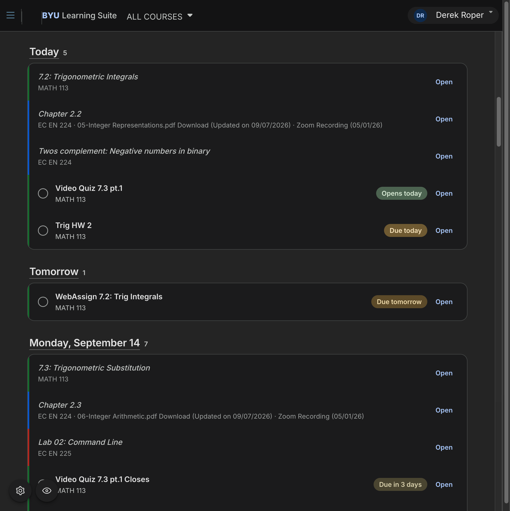
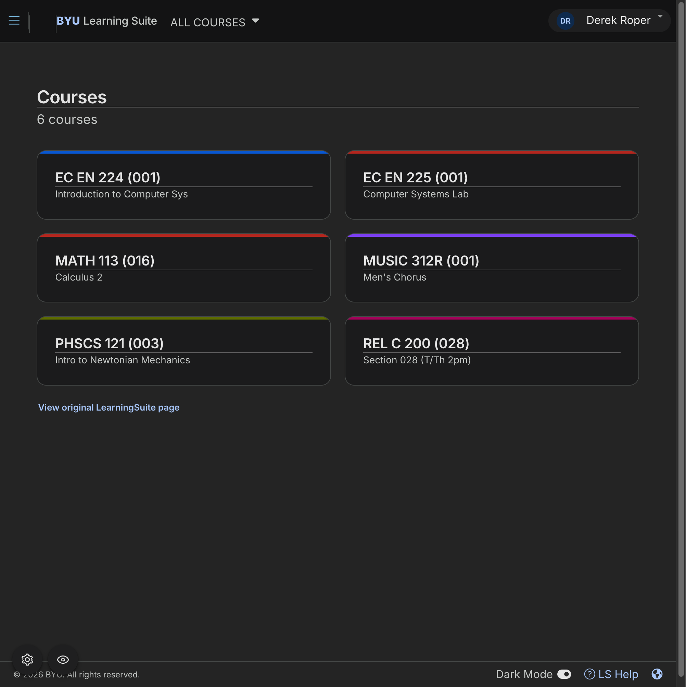
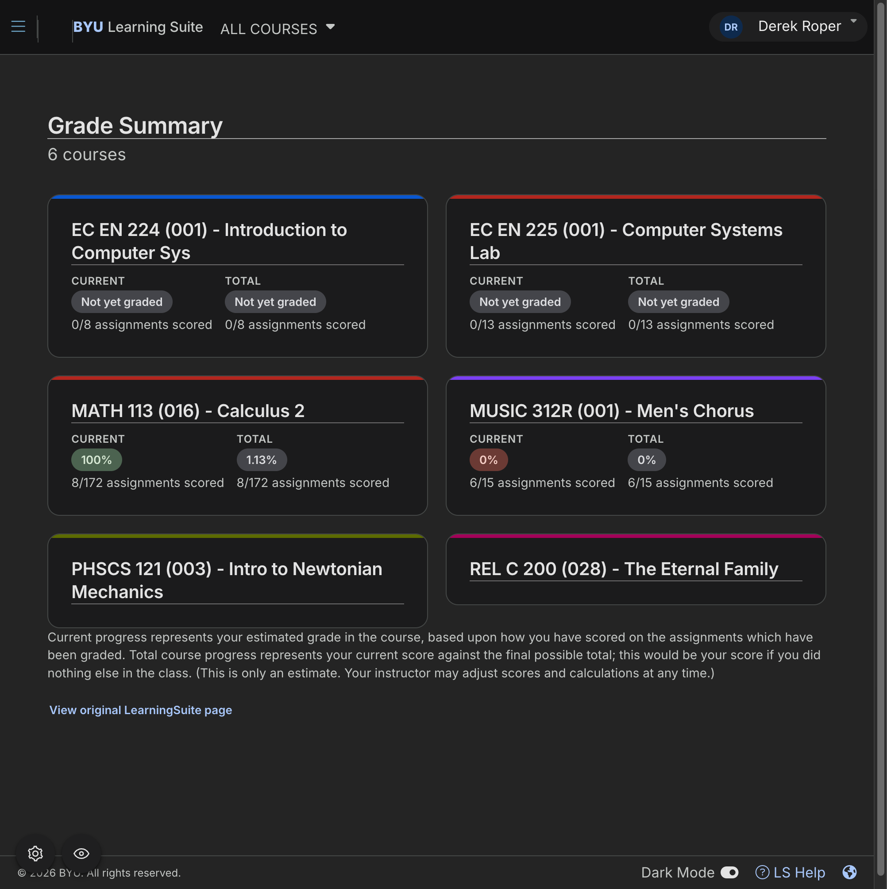

#  LearningSuite Reskin



LearningSuite Reskin is a free, open-source userscript that makes BYU LearningSuite easier to
scan and use. It is a visual layer over the normal site—not a replacement. Sign-in, assignments,
quizzes, grades, and links still use LearningSuite itself.

> BYU LearningSuite Reskin is an independent student project. It is not affiliated with or
> endorsed by Brigham Young University.

## Install

Choose your device. The script runs only on `https://learningsuite.byu.edu/*`.

### Chrome on Windows

1. Install [Tampermonkey](https://www.tampermonkey.net/index.php?browser=chrome) from the Chrome Web Store.
2. Right-click its toolbar icon → **Manage extension** → turn on **Allow User Scripts**. If Chrome does not show that option, open `chrome://extensions` and enable **Developer mode**.
3. Open Tampermonkey's **Details** page. Under **Site access**, select **On specific sites** and add `https://learningsuite.byu.edu/*`.
4. Open [Install LearningSuite Reskin](https://raw.githubusercontent.com/droper23/learningsuite-reskin/main/dist/learningsuite-reskin.user.js) and choose **Install** in Tampermonkey.
5. Open or refresh LearningSuite.

To disable it, open Tampermonkey → Dashboard and toggle off **LearningSuite Reskin**.

### iPhone or iPad

1. Install [Userscripts](https://apps.apple.com/us/app/userscripts/id1463298887) from the App Store.
2. Open the Userscripts app once and choose its scripts folder. Then enable it in **Settings → Safari → Extensions → Userscripts**.
3. Download [`learningsuite-reskin.user.js`](https://github.com/droper23/learningsuite-reskin/releases/latest/download/learningsuite-reskin.user.js) from the latest GitHub release.
4. In the Files app, move the downloaded file into the scripts folder chosen in step 2. Keep the `.user.js` filename extension.
5. Open the Userscripts popup once, then reload LearningSuite.

Do not rely on Safari showing an install prompt. Userscripts loads valid `.user.js` files from its
chosen folder, so the release download and Files app are the supported installation route.

### macOS Safari

1. Install [Userscripts](https://apps.apple.com/us/app/userscripts/id1463298887) and enable it for LearningSuite in Safari Settings → Extensions.
2. Open a new tab, click the Userscripts toolbar icon, then click **Open Extension Page**.
3. Click the **+** button and choose **New Remote**.
4. Paste in the raw GitHub URL for the script: `https://raw.githubusercontent.com/droper23/learningsuite-reskin/main/dist/learningsuite-reskin.user.js`
5. Save with <kbd>Cmd</kbd>-<kbd>S</kbd>.
6. Reload LearningSuite.

### Firefox or Microsoft Edge

Install [Tampermonkey](https://www.tampermonkey.net/) or
[Violentmonkey](https://violentmonkey.github.io/), then open the [install link](https://raw.githubusercontent.com/droper23/learningsuite-reskin/main/dist/learningsuite-reskin.user.js). In Edge, use the same **Allow User Scripts** and per-site access setup as Chrome.

## What it changes

- Course List becomes a card grid.
- Assignments become a readable grouped list while preserving the original LearningSuite actions.
- Combined Schedule becomes a day-grouped agenda.
- Light mode, dark mode, reduced motion, backgrounds, and Compatibility Mode are available from the in-page settings button.

Pages not yet redesigned stay in their native LearningSuite form.

## Gallery

| Course List | Grade Summary |
| --- | --- |
|  |  |

## Privacy and safety

The script does not collect analytics, use a backend, read passwords, cookies, Duo codes, or
session IDs. It reads only content LearningSuite has already rendered in the current page.

External Calendars are optional and off by default. If enabled, the script reads only the calendar
feed URL a student explicitly provides. See [PRIVACY.md](PRIVACY.md) for details.

If a LearningSuite update causes a layout problem, disable the script from your userscript manager
or turn on Compatibility Mode. The original LearningSuite interface remains available immediately.

## Updates

Userscript managers can check the built-in update URL automatically. You can also reinstall from
the [install link](https://raw.githubusercontent.com/droper23/learningsuite-reskin/main/dist/learningsuite-reskin.user.js) or download the current file from [GitHub Releases](https://github.com/droper23/learningsuite-reskin/releases/latest).

## Development

```sh
npm ci
npm test
npm run typecheck
npm run build
```

The distributable file is `dist/learningsuite-reskin.user.js`; commit it with the source whenever
you publish a new version. Pull requests should not include real LearningSuite data, credentials,
or unredacted screenshots.

## License

[MIT](LICENSE)
